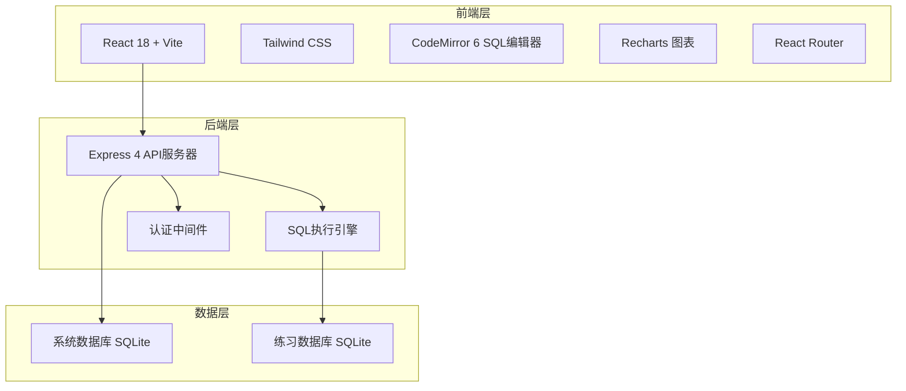
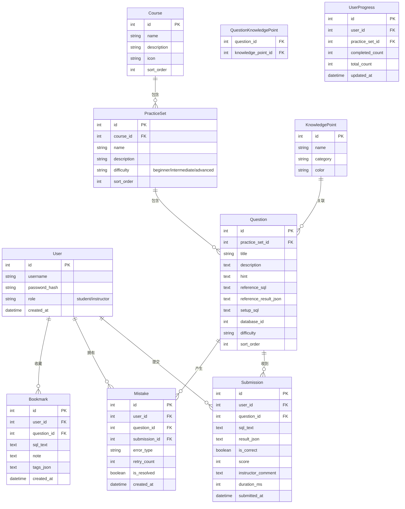

## 1. 架构设计



## 2. 技术说明

- **前端**：React@18 + TailwindCSS@3 + Vite
- **初始化工具**：Vite（React + TypeScript 模板）
- **后端**：Express@4，提供 REST API
- **数据库**：SQLite（系统库存储用户/题目/提交记录，练习库用于学员执行 SQL）
- **SQL 编辑器**：CodeMirror 6（SQL 模式、语法高亮、自动补全）
- **图表**：Recharts（知识点统计、掌握度雷达图）
- **路由**：React Router v6
- **状态管理**：Zustand
- **代码风格**：ESLint + Prettier

## 3. 路由定义

| 路由 | 用途 |
|------|------|
| `/login` | 登录/注册页面 |
| `/courses` | 课程目录页面 |
| `/practice/:setId` | 题目练习页面（练习集 ID） |
| `/practice/:setId/:questionId` | 题目练习页面（具体题目） |
| `/result/:submissionId` | 结果校验页面 |
| `/instructor/questions` | 讲师题目管理 |
| `/instructor/submissions` | 讲师提交记录查看 |
| `/instructor/review` | 讲师批量点评 |
| `/instructor/stats` | 讲师知识点统计 |
| `/mistakes` | 错题本页面 |
| `/bookmarks` | 收藏写法页面 |

## 4. API 定义

### 认证
```
POST   /api/auth/register     { username, password, role } → { user, token }
POST   /api/auth/login        { username, password } → { user, token }
GET    /api/auth/me           → { user }
```

### 课程与练习集
```
GET    /api/courses           → Course[]
GET    /api/courses/:id       → Course (含练习集列表)
GET    /api/practice-sets/:id → PracticeSet (含题目列表)
```

### 题目
```
GET    /api/questions/:id     → Question (含表结构、示例数据)
POST   /api/questions          → Question (创建题目)
PUT    /api/questions/:id     → Question (更新题目)
DELETE /api/questions/:id     → void
```

### SQL 执行
```
POST   /api/sql/execute      { sql, databaseId } → { columns, rows, error, duration }
POST   /api/sql/submit       { questionId, sql } → Submission (含校验结果)
```

### 提交与批改
```
GET    /api/submissions       → Submission[] (支持筛选)
GET    /api/submissions/:id   → Submission (含对比结果)
POST   /api/submissions/batch-review  { reviews: [{ id, score, comment }] } → void
```

### 错题本
```
GET    /api/mistakes          → Mistake[]
DELETE /api/mistakes/:id      → void
POST   /api/mistakes/:id/retry → Mistake (重做更新)
```

### 收藏
```
GET    /api/bookmarks         → Bookmark[]
POST   /api/bookmarks         { sql, note, tags } → Bookmark
DELETE /api/bookmarks/:id     → void
```

### 统计
```
GET    /api/stats/knowledge-points → KnowledgePointStat[]
GET    /api/stats/export           → CSV 文件流
```

### 表结构与示例数据
```
GET    /api/schema/:databaseId → TableSchema[]
GET    /api/sample-data/:tableName → Row[]
```

## 5. 服务器架构图

```mermaid
flowchart LR
    "Controller" --> "Service"
    "Service" --> "Repository"
    "Repository" --> "SQLite 系统库"
    "Service" --> "SQL执行引擎"
    "SQL执行引擎" --> "SQLite 练习库"
```

## 6. 数据模型

### 6.1 数据模型定义



### 6.2 数据定义语言

```sql
CREATE TABLE users (
    id INTEGER PRIMARY KEY AUTOINCREMENT,
    username TEXT NOT NULL UNIQUE,
    password_hash TEXT NOT NULL,
    role TEXT NOT NULL CHECK(role IN ('student', 'instructor')),
    created_at DATETIME DEFAULT CURRENT_TIMESTAMP
);

CREATE TABLE courses (
    id INTEGER PRIMARY KEY AUTOINCREMENT,
    name TEXT NOT NULL,
    description TEXT,
    icon TEXT,
    sort_order INTEGER DEFAULT 0
);

CREATE TABLE knowledge_points (
    id INTEGER PRIMARY KEY AUTOINCREMENT,
    name TEXT NOT NULL,
    category TEXT,
    color TEXT DEFAULT '#00d2ff'
);

CREATE TABLE practice_sets (
    id INTEGER PRIMARY KEY AUTOINCREMENT,
    course_id INTEGER NOT NULL REFERENCES courses(id),
    name TEXT NOT NULL,
    description TEXT,
    difficulty TEXT DEFAULT 'beginner' CHECK(difficulty IN ('beginner', 'intermediate', 'advanced')),
    sort_order INTEGER DEFAULT 0
);

CREATE TABLE questions (
    id INTEGER PRIMARY KEY AUTOINCREMENT,
    practice_set_id INTEGER NOT NULL REFERENCES practice_sets(id),
    title TEXT NOT NULL,
    description TEXT,
    hint TEXT,
    reference_sql TEXT,
    reference_result_json TEXT,
    setup_sql TEXT,
    database_id INTEGER DEFAULT 1,
    difficulty TEXT DEFAULT 'beginner',
    sort_order INTEGER DEFAULT 0
);

CREATE TABLE question_knowledge_points (
    question_id INTEGER NOT NULL REFERENCES questions(id),
    knowledge_point_id INTEGER NOT NULL REFERENCES knowledge_points(id),
    PRIMARY KEY (question_id, knowledge_point_id)
);

CREATE TABLE submissions (
    id INTEGER PRIMARY KEY AUTOINCREMENT,
    user_id INTEGER NOT NULL REFERENCES users(id),
    question_id INTEGER NOT NULL REFERENCES questions(id),
    sql_text TEXT NOT NULL,
    result_json TEXT,
    is_correct BOOLEAN DEFAULT 0,
    score INTEGER DEFAULT 0,
    instructor_comment TEXT,
    duration_ms INTEGER DEFAULT 0,
    submitted_at DATETIME DEFAULT CURRENT_TIMESTAMP
);

CREATE TABLE mistakes (
    id INTEGER PRIMARY KEY AUTOINCREMENT,
    user_id INTEGER NOT NULL REFERENCES users(id),
    question_id INTEGER NOT NULL REFERENCES questions(id),
    submission_id INTEGER REFERENCES submissions(id),
    error_type TEXT,
    retry_count INTEGER DEFAULT 0,
    is_resolved BOOLEAN DEFAULT 0,
    created_at DATETIME DEFAULT CURRENT_TIMESTAMP
);

CREATE TABLE bookmarks (
    id INTEGER PRIMARY KEY AUTOINCREMENT,
    user_id INTEGER NOT NULL REFERENCES users(id),
    question_id INTEGER REFERENCES questions(id),
    sql_text TEXT NOT NULL,
    note TEXT,
    tags_json TEXT DEFAULT '[]',
    created_at DATETIME DEFAULT CURRENT_TIMESTAMP
);

CREATE TABLE user_progress (
    id INTEGER PRIMARY KEY AUTOINCREMENT,
    user_id INTEGER NOT NULL REFERENCES users(id),
    practice_set_id INTEGER NOT NULL REFERENCES practice_sets(id),
    completed_count INTEGER DEFAULT 0,
    total_count INTEGER DEFAULT 0,
    updated_at DATETIME DEFAULT CURRENT_TIMESTAMP,
    UNIQUE(user_id, practice_set_id)
);

CREATE INDEX idx_submissions_user ON submissions(user_id);
CREATE INDEX idx_submissions_question ON submissions(question_id);
CREATE INDEX idx_mistakes_user ON mistakes(user_id);
CREATE INDEX idx_mistakes_unresolved ON mistakes(user_id, is_resolved);
CREATE INDEX idx_bookmarks_user ON bookmarks(user_id);
CREATE INDEX idx_user_progress_user ON user_progress(user_id);
```
